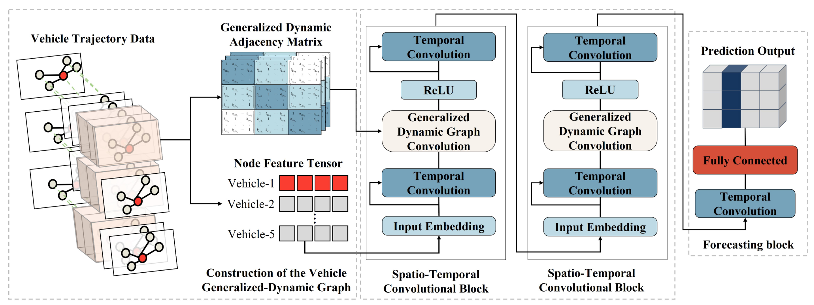
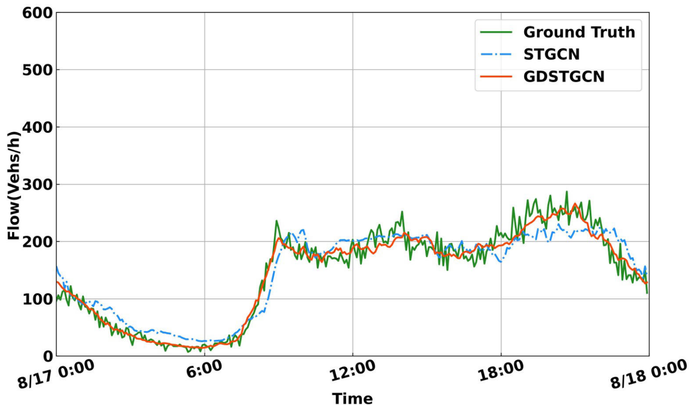
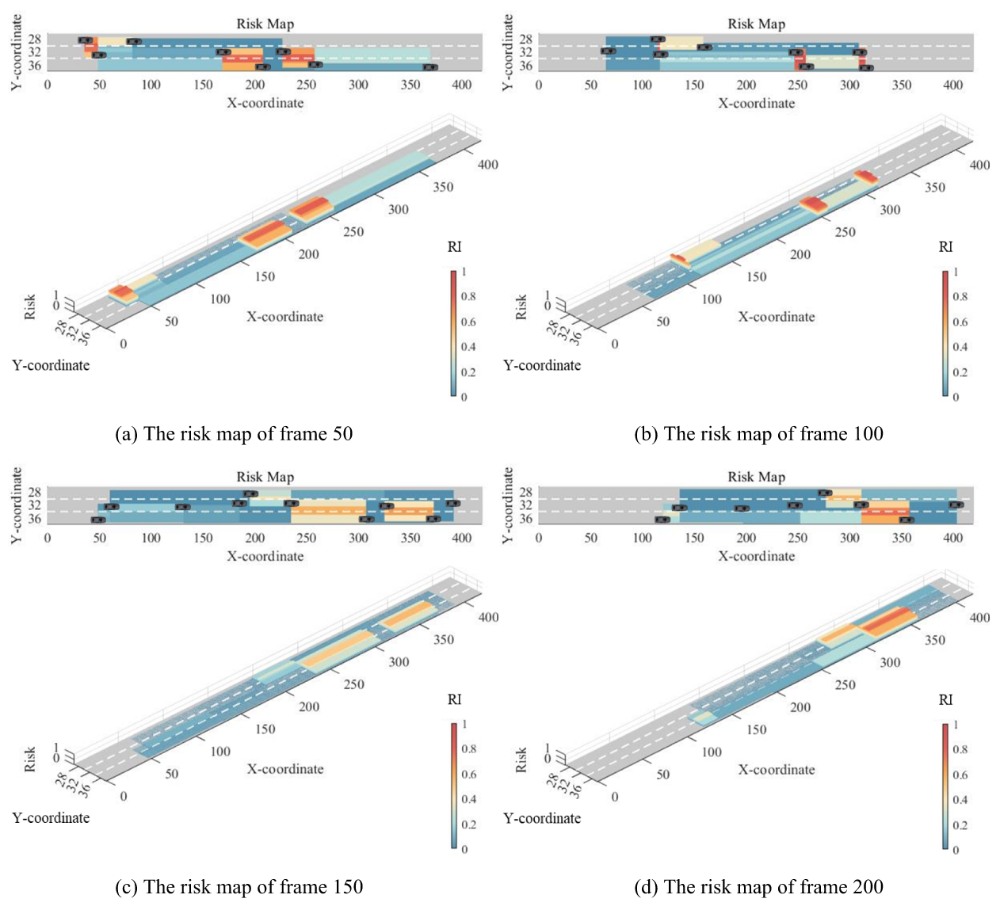
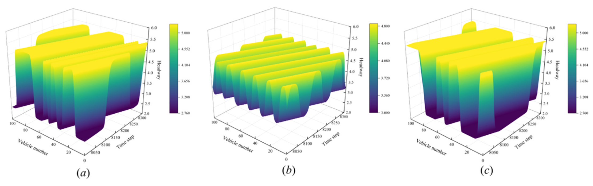
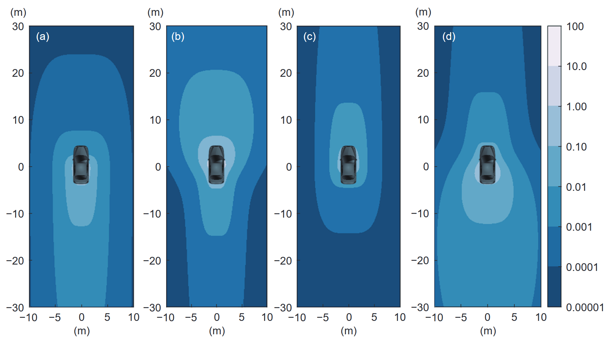
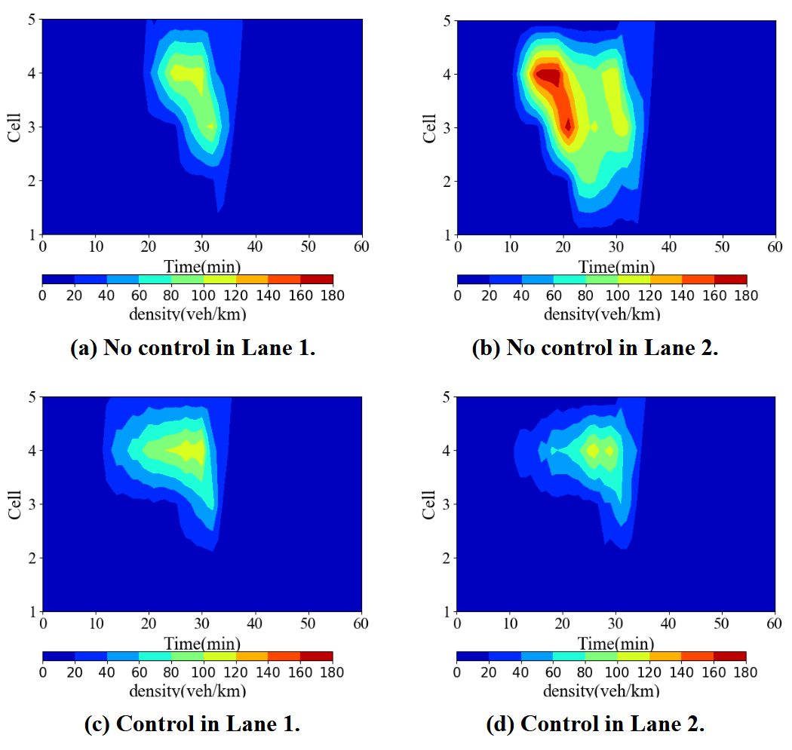
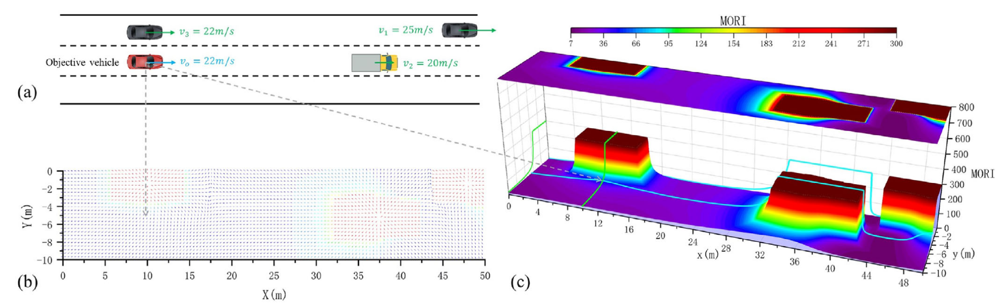
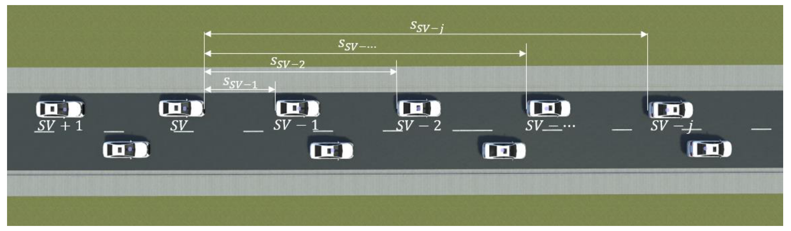
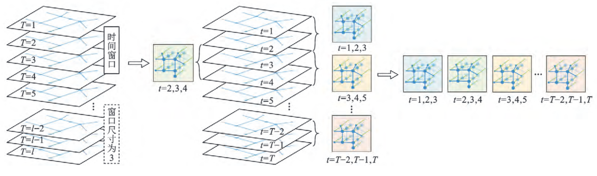

Paper-009
======
* Vehicular Speed Prediction Method for Highway Scenarios Based on Spatio-Temporal Graph Convolutional Networks and Potential Field Theory
  * Authors: Linheng LI, **Bocheng AN**, Dapeng ZHANG, Rui GAN, Zhi Zhou, Xu QU, and Bin RAN
  * Doi: [10.1109/JIOT.2024.3479221](https://dx.doi.org/10.1109/JIOT.2024.3479221)
  * Abstract: Traffic flow analysis largely depends on accurate predictions of microscopic speed. Due to the complexity and stochastic of real-world driving environments, traditional model-driven methods face significant challenges. In recent years, data-driven methods that combine advanced intelligent algorithms have emerged to address the issue of vehicle speed prediction. However, most existing studies primarily focus on the static spatio-temporal relationships between vehicles, with only a few exploring dynamic spatio-temporal correlations. In this study, a new graph structure, named the vehicle generalized-dynamic graph, is constructed to characterize the vehicle trajectory, emphasizing the spatial and temporal evolution of vehicles. In the spatial dimension, we employ the potential field theory to compute the field strength of vehicles in different motion states, enhancing the description of interdependencies among vehicles. In the temporal dimension, the movements of each vehicle at different time points are interrelated. Furthermore, we propose a novel neural network architecture, named the Dynamic Edge Graph Convolutional Network (DEGCN), to address the vehicle speed prediction problem. The DEGCN model is evaluated through experiments on three real-world vehicle trajectory datasets. The experimental results demonstrate that the proposed model outperforms other baseline models in terms of prediction performance. Additionally, various ablation studies are conducted to evaluate the effectiveness of different components, the potential field theory, and the vehicle generalized-dynamic graph structure.
  * Figure:
  * Citation: @article{li2024vehicular,
  title={Vehicular Speed Prediction Method for Highway Scenarios Based on Spatio-Temporal Graph Convolutional Networks and Potential Field Theory},
  author={Li, Linheng and An, Bocheng and Zhang, Dapeng and Gan, Rui and Zhou, Zhi and Qu, Xu and Ran, Bin},
  journal={IEEE Internet of Things Journal},
  year={2024},
  publisher={IEEE}
}

Paper-008
======
* A Freeway Traffic Flow Prediction Model Based on a Generalized Dynamic Spatio-Temporal Graph Convolutional Network
  * Authors: Rui Gan, **Bocheng An**, Linheng Li, Xu Qu, and Bin Ran
  * Doi: [10.1109/TITS.2024.3396382](https://dx.doi.org/10.1109/TITS.2024.3396382)
  * Abstract: The accurate prediction of traffic conditions is essential for effective and efficient traffic management and control. The dynamic and complex nature of traffic data, characterized by intricate temporal and spatial features, presents significant challenges to accurate traffic forecasting. While previous studies have developed various models with advanced algorithms, they often fail to fully capture the holistic spatio-temporal features and the dynamically evolving correlations within traffic networks. Additionally, these studies often overlook the potential of adjacency matrices learned from real-time traffic data to more accurately represent the interconnectivity of nodes within road network. To address these gaps, this study introduces the Generalized Dynamic Spatio-Temporal Graph Convolutional Network (GDSTGCN), a novel prediction model tailored for traffic data. First, this model builds a learning-based generalized dynamic graph structure, which incorporates both spatial and temporal connections and evolves with real-time traffic data. Then, a generalized dynamic graph convolution, integrated with graph diffusion, is crafted to operate on the designed generalized dynamic graph structure. This plays a critical role in holistically capturing local and global spatio-temporal traffic dependencies. Moreover, the generalized dynamic graph convolution is incorporated with Temporal convolution and other essential components, forming a cohesive framework that enables effective and efficient traffic flow predictions. To validate the performance of the GDSTGCN model, we conducted extensive experiments using four real-world road network datasets. The results demonstrate that our model outperforms existing state-of-the-art GCN-based models and traditional baseline methods.
  * Figure:
  * Citation: @article{gan2024freeway,
  title={A Freeway Traffic Flow Prediction Model Based on a Generalized Dynamic Spatio-Temporal Graph Convolutional Network},
  author={Gan, Rui and An, Bocheng and Li, Linheng and Qu, Xu and Ran, Bin},
  journal={IEEE Transactions on Intelligent Transportation Systems},
  year={2024},
  publisher={IEEE}
}

Paper-007
======
* A freeway vehicle early warning method based on risk map: Enhancing traffic safety through global perspective characterization of driving risk
  * Authors: Chuang Cui, **Bocheng An**, Linheng Li, Xu Qu, Huhe Manda, Bin Ran
  * Doi: [10.1016/j.aap.2024.107611](https://dx.doi.org/10.1016/j.aap.2024.107611)
  * Abstract: In the era of rapid advancements in intelligent transportation, utilizing vehicle operating data to evaluate the risk of freeway vehicles and study on vehicle early warning methods not only lays a theoretical foundation for improving the active safety of vehicles, but also provides the technical support for reducing accident rate. This paper proposes a freeway vehicle early warning method based on risk map to enhance vehicle safety. Firstly, Modified Time-to-Collision (MTTC), a two-dimensional indicator that describes the risk of inter-vehicle travel, is used as an indicator of road traffic risk. This paper designs a transformation function to probabilistically transform MTTC into Risk Indicators (RI). The single-vehicle risk map is generated based on the mapping relationship between the risk values and the corresponding roadway segments. These single-vehicle risk maps of all vehicles on the road are superimposed to construct the risk map, which is used to describe the risk distribution in the freeway. Then, a vehicle early warning framework is built based on the risk map. The risk values in the risk map are compared with predefined early warning thresholds to alert the vehicle when it enters a high-risk state. Finally, VISSIM is used to carry out simulation experiments. The experiment simulates a freeway accident stopping situation. This scenario includes sub-scenarios such as unplanned stopping and lane-changing, continuous lane-changing, and adjacent lane overtaking. We analyze the risk map and vehicle warning results in different sub-scenarios, evaluate the risk changes of the vehicles before and after receiving the warning, and compare the warning results of the method in this paper with other alternative methods. The method is applied to 17 vehicles in the simulation to adjust their motion states. The results show that the total warning time is reduced by 29.6% and 73.3% of vehicles change lanes away from the accident vehicle. The overall results validate the effectiveness of the vehicle early warning method based on risk map proposed in this paper.
  * Figure:
  * Citation: @article{cui2024freeway,
  title={A freeway vehicle early warning method based on risk map: enhancing traffic safety through global perspective characterization of driving risk},
  author={Cui, Chuang and An, Bocheng and Li, Linheng and Qu, Xu and Manda, Huhe and Ran, Bin},
  journal={Accident Analysis \& Prevention},
  volume={203},
  pages={107611},
  year={2024},
  publisher={Elsevier}
}

Paper-006
======
* Stability analysis and numerical simulation of a car-following model considering safety potential field and V2X communication: A focus on influence weight of multiple vehicles
  * Authors: Linheng Li, **Bocheng An**, Zhiyu Wang, Jing Gan, Xu Qu, Bin Ran
  * Doi: [10.1016/j.physa.2024.129706](https://dx.doi.org/10.1016/j.physa.2024.129706)
  * Abstract: In a V2X environment, the target vehicle is capable of acquiring motion information from mul­ tiple vehicles ahead, and this information plays a crucial role in predicting the target vehicle’s motion behavior. To better understand how leading vehicles affect the car-following behavior of the target vehicle, we have developed an improved car-following model that considers the effects of multiple leading vehicles. This model constructs distance-based and field-based models to describe the influence weights of different vehicles on the target vehicle. The stability conditions of the model were obtained through linear stability analysis, and the mKdV equation, which describes the evolution characteristics of traffic density waves in congested areas, was determined through nonlinear analysis. Numerical simulations were conducted to discuss the multi-vehicle effect λ, different vehicle influence weights (distance-based and field-based models) βj, and the number of leading vehicles considered q. The study found that in congested areas, initial per­ turbations evolve in the form of kink-antikink waves, moving rearward, with the amplitude of the headway curve decreasing as the multi-vehicle effect coefficient value increases. For different vehicle influence weights, the field-based model outperforms the distance-based model. More­ over, as the number of leading vehicles considered q increases, the stability of traffic flow gradually improves. The numerical results are consistent with the theoretical findings, and it is noted that the model successfully enhances vehicular movement efficiency, reduces congestion, and improves road safety. To minimize collision incidents, the improved model can be imple­ mented as an active safety technology.
  * Figure:
  * Citation: @article{li2024stability,
  title={Stability analysis and numerical simulation of a car-following model considering safety potential field and V2X communication: A focus on influence weight of multiple vehicles},
  author={Li, Linheng and An, Bocheng and Wang, Zhiyu and Gan, Jing and Qu, Xu and Ran, Bin},
  journal={Physica A: Statistical Mechanics and its Applications},
  volume={640},
  pages={129706},
  year={2024},
  publisher={Elsevier}
}

Paper-005
======
* Anisotropy safety potential field model under intelligent and connected vehicle environment and its application in car-following modeling
  * Authors: Haozhan Ma, **Bocheng An**, Linheng Li, Zhi Zhou, Xu Qu, Bin Ran
  * Doi: [10.26599/JICV.2023.9210006](https://dx.doi.org/10.26599/JICV.2023.9210006)
  * Abstract: Potential field theory, as a theory that can also be applied to vehicle control, is an emerging risk quantification approach to accommodate the connected and self-driving vehicle environment. Vehicles have different risk impact effects on other road participants in each direction under the influence of road rules. This variability exhibited by vehicles in each direction is not considered in the previous potential field model. Therefore, this paper proposed a potential field model that takes the anisotropy of vehicle impact into account: (1) introducing equivalent distances to separate the potential field area in the different directions before and after the vehicle; (2) introducing co-virtual forces to characterize the effect of the sideby-side travel phenomenon on vehicle car-following travel; (3) introducing target forces and lane resistance, which regress the control of desired speed to control the acceptable risk of drivers. The Next Generation Simulation (NGSIM) dataset is used in this study to create the model's initial parameter values based on the artificial swarm algorithm. The simulation findings indicate that when the vehicle is given the capacity to perceive the surrounding traffic environment, the suggested the anisotropic safety potential field model (ASPFM) performs better in terms of driving safety.
  * Figure:
  * Citation: @article{ma2023anisotropy,
  title={Anisotropy safety potential field model under intelligent and connected vehicle environment and its application in car-following modeling},
  author={Ma, Haozhan and An, Bocheng and Li, Linheng and Zhou, Zhi and Qu, Xu and Ran, Bin},
  journal={Journal of Intelligent and Connected Vehicles},
  volume={6},
  number={2},
  pages={79--90},
  year={2023},
  publisher={TUP}
}

Paper-004
======
* Cooperative Control Strategy of Variable Speed Limit and Lane Change Guidance in Freeway Bottleneck Area
  * Authors: Chuang Cui, **Bocheng An**, and Xu Qu
  * Doi: [10.1061/9780784484869.128](https://dx.doi.org/10.1061/9780784484869.128)
  * Abstract: Intelligent connected transportation is an important technique to alleviate traffic congestion and improve traffic safety. Considering the congestion problem in the bottleneck area of the freeway under the intelligent connected transportation environment, this paper proposes a cooperative control strategy which combines the variable speed limit (VSL) and lane change guidance (LCG). First, based on the fundamental diagram, the freeway bottleneck area is divided into cells according to the lanes. The lane-level cell transmission model (LCTM) is established. Then, an optimization model is built with the main goals of efficiency, safety, and comfort. A genetic algorithm (GA) is used to solve the model. After that, the VSL and LCG are combined and a cooperative control strategy based on model predictive control (MPC) is proposed. Finally, simulation experiments are carried out with Python. The results show that the cooperative control strategy can significantly improve the traffic operation of freeway bottleneck area.
  * Figure:
  * Citation: @article{li2024stability,
  title=@incollection{cui2023cooperative,
  title={Cooperative Control Strategy of Variable Speed Limit and Lane Change Guidance in Freeway Bottleneck Area},
  author={Cui, Chuang and An, Bocheng and Qu, Xu},
  booktitle={CICTP 2023},
  pages={1340--1350},
  year={2023}
}

Paper-003
======
* Mass‐based omni‐directional risk indicator (MORI) for multi‐participant traffic
  * Authors: Haozhan Ma, Linheng Li, **Bocheng An**, Ziwei Yi, Xu Qu, Bin Ran
  * Doi: [10.1049/itr2.12405](https://dx.doi.org/10.1049/itr2.12405)
  * Abstract: This study focuses on the potential of connected and automated vehicles (CAVs) to enhance road traffic safety through the provision of rich physical motion state information. Real-time risk indicators are crucial for improving driving safety and must be tailored to the specific characteristics of the CAV environment. To this end, this paper introduces the concept of “risk pair” to decompose the joint actions of multiple traffic participants into pairwise interactions. An omnidirectional risk indicator (ORI) is developed to describe the effect of “risk pairs”, and the superposition of ORI based on quality is proposed as the mass-based ORI (MORI). A comparison between MORI and existing risk indicators shows that MORI has good performance in quantifying one-dimensional scenarios. In two-dimensional scenarios involving multiple participating entities, MORI provides two quantitative results: vector summation and scalar summation. The trajectory data from the next generation simulation database is used to validate the MORI model. The results show that both vector summation and scalar summation of MORI demonstrate strong risk quantification capabilities with different directions. Although some limitations of MORI still exist, this approach will provide a scientifically effective means of risk quantification for two-dimensional complex scenarios.
  * Figure:
  * Citation: @article{ma2023mass,
  title={Mass-based omni-directional risk indicator (MORI) for multi-participant traffic},
  author={Ma, Haozhan and Li, Linheng and An, Bocheng and Yi, Ziwei and Qu, Xu and Ran, Bin},
  journal={IET Intelligent Transport Systems},
  volume={17},
  number={11},
  pages={2251--2267},
  year={2023},
  publisher={Wiley Online Library}
}

Paper-002
======
* A Cooperative Lane-Changing Approach Considering the Motion Similarity between Vehicles
  * Authors: **Bocheng An**, Xu Qu
  * Doi: [10.1061/9780784484265.137](https://dx.doi.org/10.1061/9780784484265.137)
  * Abstract: This paper proposes a cooperative lane-changing approach that considers the motion similarity between vehicles and conducts the numerical simulation experiment to verify its effectiveness. First, we take advantage of the real-time information interaction under connected and automated vehicle environment to design the lane-changing process. Second, the motion similarity between vehicles is used to improve the Intelligent Driver Model and the Minimizing Overall Braking Induced by Lane Changes model. Additionally, we consider the preceding vehicles’ influence on the subject vehicle lane-changing intention and analyze the benefits of the subject vehicle lane-changing behavior on the traffic flows. Finally, we conduct a numerical simulation experiment based on MATLAB. The cooperative lane-changing approach is evaluated from the homogeneity of traffic flow, efficiency, safety, and comfort. The simulation results show that the cooperative lane-changing approach we proposed can effectively reduce delays, reduce the probability of vehicle collisions and reduce the braking amplitude of traffic flow.
  * Figure:
  * Citation: @incollection{an2022cooperative,
  title={A Cooperative Lane-Changing Approach Considering the Motion Similarity between Vehicles},
  author={An, Bocheng and Qu, Xu},
  booktitle={CICTP 2022},
  pages={1458--1468},
  year={2022}
}

Paper-001
======
* Prediction of traffic swarm movement situation based on generalized spatio-temporal graph convolution network
  * Authors: Xu Qu, Rui Gan, **Bocheng An**, Linheng Li, Zhijun Chen, Bin Ran
  * Doi: [10.19818/j.cnki.1671-1637.2022.03.006](https://dx.doi.org/10.19818/j.cnki.1671-1637.2022.03.006)
  * Abstract: To address the problem that traffic congestion on highways and urban expressways is becoming more and more serious and causes great difficulties for traffic management and control, a traffic speed prediction model was proposed based on the generalized spatio-temporal graph convolution network (GSTGCN). According to the complex spatio-temporal characteristics of traffic data, the generalized traffic data graph structure was defined, and the adjacency relationships of the generalized graph were constructed. By the basic theory of graph convolution network, the Chebyshev approximation and the first-order approximation were adopted to simplify the computational cost of the graph convolution operation, and a generalized graph convolution operator was established. With the generalized graph convolution module, standard convolution module, and linear fully-connected layer, a GSTGCN model was presented to extract the spatial and temporal characteristics of complex traffic data. The vehicle speed, flow, and occupancy datum were recorded by 38 detectors at 5-minute intervals for 21 weekdays on the expressway network in Milwaukee, Wisconsin, USA. The short-term traffic speed prediction accuracy and training efficiency of the GSTGCN model were evaluated on this data set. Analysis results show that compared with the results of the traditional auto regressive integrated moving average (ARIMA) model, the long short-term memory (LSTM) model, and the recent spatio-temporal graph convolution network (STGCN) model, the root mean square error, mean absolute error, and mean absolute percentage error of the GSTGCN model in the traffic speed prediction reduces by 22.79%, 22.97%, and 16.73%, respectively. Moreover, the training time of the GSTGCN model is 5.17% and 75.71% shorter than those of the STGCN model and LSTM model, respectively. Therefore, the GSTGCN model is able to effectively deal with the complex spatio-temporal traffic data structure, accurately predict the traffic speed, and provide information on the movement situation of traffic swarm for the traffic control and management.
  * Figure:
  * Citation: @article{xu2022prediction,
  title={Prediction of traffic swarm movement situation based on generalized spatio-temporal graph convolution network},
  author={Xu, QU and Rui, GAN and Bo-cheng, AN and Lin-heng, LI and Zhi-jun, CHEN and Bin, RAN},
  journal={交通运输工程学报},
  volume={22},
  number={3},
  pages={79--88},
  year={2022},
  publisher={交通运输工程学报}
}
